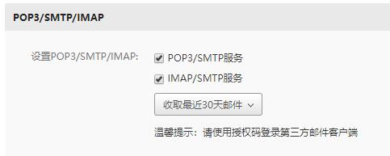
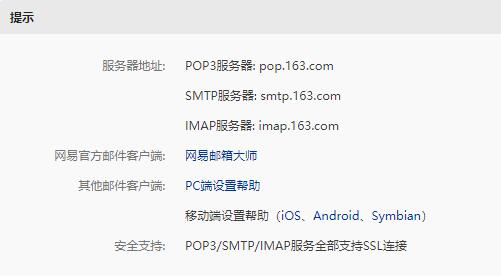
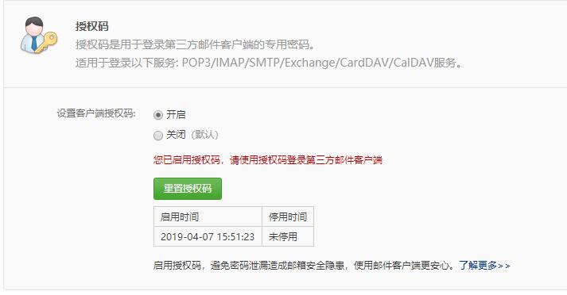
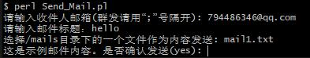

# Perl_SMTP

本项目使用 Net::SMTP_auth 模块实现邮件发送客户端，该模块的更多细节参考 [官方文档](https://metacpan.org/pod/Net::SMTP_auth)。

SMTP 全称 Simple Mail Transfer Protocol（简单邮件传送协议），是计算机网络应用层中发送电子邮件的一种协议。最初的 SMTP 的局限之一在于它没有对发送方进行身份验证的机制。因此，后来定义了 SMTP-AUTH 扩展。本程序也是基于 SMTP-AUTH 拓展实现的邮件客户端程序。

## 项目结构

```
|-- Perl_SMTP
    |-- README.md
    |-- src
    |-- mails
    |-- conf
        |-- conf.json
    |-- lib
        |-- JSON.pm
        |-- Digest
        |-- JSON
        |-- Net
    |-- perl
        |-- Send_Mail.pl

```

## 安装 Net::SMTP_auth

进入 /lib 目录，依次输入如下命令安装 SMTP_auth 模块

```
tar zxvf Net-SMTP_auth-0.08.tar.gz
cd Net-SMTP_auth-0.08
perl Makefile.pl
make test
make install
```

## 设置你的第三方邮箱客户端

选择你的邮件服务提供商，这里以网易邮箱为例，进入你的网易邮箱开启你的 POP3/SMTP 服务。



然后配置 conf/conf.json 文件

```
{
    "user_name":"yourname",
    "mail_address":"youraddress@123.com",
    "mail_server":"smtp.123.com",
    "mail_password":"yourpassword"
}
```

* user_name：你的邮箱用户名
* mail_address：你的邮箱地址
* mail_server: 邮件服务商的 SMTP 服务器，可以在上面的设置界面找到，网易的是 smtp.163.com
* mail_password：你的邮箱的密码，这里应该是客户端授权密码





## 编写邮件内容

进入 /mails 文件夹，在里面添加文件，如 mail1.txt，在其中编写邮件内容。

## 发送邮件

进入 /perl 文件夹，运行 Send_Mail.pl 发送邮件



